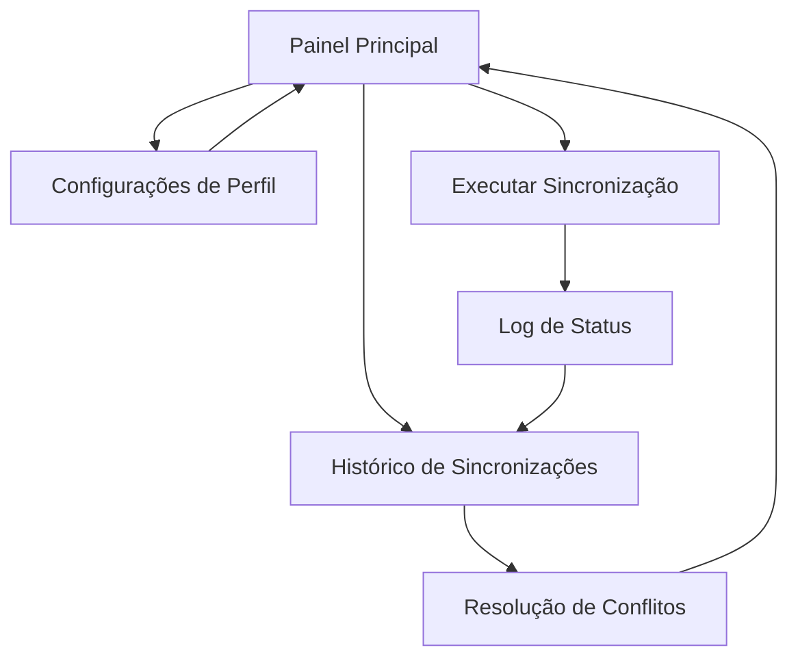

# Documento de Requisitos do Produto (PRD): GitHub Sync Pro

## 1. Visão Geral do Produto
O GitHub Sync Pro é uma aplicação web de tela única que automatiza a sincronização bidirecional entre ambientes locais/nuvem e repositórios GitHub. A ferramenta simplifica o gerenciamento de código para desenvolvedores que trabalham em múltiplos ambientes, oferecendo automação completa de commits, pulls e backups sem necessidade de comandos manuais via terminal.

- Resolve o problema de sincronização manual complexa entre diferentes ambientes de desenvolvimento
- Destinado a desenvolvedores independentes e equipes pequenas que precisam de consistência entre local, nuvem e GitHub
- Oferece valor através da automação de rotinas repetitivas e prevenção de perda de dados

## 2. Funcionalidades Principais

### 2.1 Papéis de Usuário
| Papel | Método de Registro | Permissões Principais |
|-------|-------------------|----------------------|
| Desenvolvedor Individual | Registro via GitHub OAuth | Acesso completo a repositórios pessoais, configuração de rotinas |
| Membro de Equipe | Convite via token de equipe | Acesso a repositórios compartilhados, sincronização colaborativa |

### 2.2 Módulos de Funcionalidade
Nossa aplicação de sincronização GitHub consiste nas seguintes páginas principais:
1. **Painel Principal**: seção de autenticação, campos de origem/destino, configurações de ação, ferramentas automatizadas, log de status em tempo real
2. **Configurações de Perfil**: gerenciamento de múltiplas contas GitHub, tokens de API, preferências de segurança
3. **Histórico de Sincronizações**: log detalhado de operações, resolução de conflitos, downloads de backup

### 2.3 Detalhes das Páginas
| Nome da Página | Nome do Módulo | Descrição da Funcionalidade |
|----------------|----------------|-----------------------------|
| Painel Principal | Seção de Autenticação | Verificar credenciais GitHub automaticamente, editar/revogar tokens, alternar entre perfis |
| Painel Principal | Campos de Entrada | Inserir origem do código (GitHub URL, caminho local, plataforma full-stack), especificar destino, validar links/caminhos |
| Painel Principal | Configurações de Ação | Executar sincronização manual, criar repositório novo, configurar visibilidade (público/privado) |
| Painel Principal | Ferramentas Automatizadas | Agendar rotinas (intervalos personalizáveis), configurar triggers automáticos, gerenciar múltiplos repositórios |
| Painel Principal | Log de Status | Exibir status em tempo real, mostrar progresso de operações, notificar conflitos e erros |
| Configurações de Perfil | Gerenciamento de Contas | Adicionar/remover contas GitHub, configurar OAuth, armazenar tokens criptografados |
| Configurações de Perfil | Preferências | Configurar temas (claro/escuro), ajustar notificações, definir configurações de segurança |
| Histórico de Sincronizações | Log de Operações | Visualizar histórico completo, filtrar por data/repositório, exportar logs |
| Histórico de Sincronizações | Resolução de Conflitos | Detectar conflitos automaticamente, oferecer opções de resolução, backup antes de merge |
| Histórico de Sincronizações | Downloads de Backup | Gerar backups ZIP, agendar backups automáticos, restaurar versões anteriores |

## 3. Processo Principal

**Fluxo do Desenvolvedor Individual:**
1. Usuário acessa o painel principal e verifica autenticação GitHub
2. Insere origem do código (local, nuvem ou GitHub) e destino desejado
3. Configura tipo de sincronização (manual ou automática)
4. Executa ação e monitora progresso no log de status
5. Acessa histórico para verificar operações e resolver conflitos se necessário

**Fluxo do Membro de Equipe:**
1. Usuário faz login com token de equipe
2. Seleciona repositórios compartilhados da lista
3. Configura sincronização colaborativa com outros membros
4. Monitora atividades da equipe no log compartilhado

## 4. Design da Interface do Usuário

### 4.1 Estilo de Design
- **Cores primárias:** #0366d6 (azul GitHub), #28a745 (verde sucesso)
- **Cores secundárias:** #6f42c1 (roxo), #dc3545 (vermelho erro), #ffc107 (amarelo aviso)
- **Estilo de botões:** Arredondados com sombra sutil, efeito hover suave
- **Fonte:** Inter 16px para texto principal, 14px para labels, 12px para logs
- **Layout:** Design de cards com navegação lateral fixa, layout responsivo
- **Ícones:** Feather icons para ações, Octicons para elementos GitHub

### 4.2 Visão Geral do Design das Páginas
| Nome da Página | Nome do Módulo | Elementos da UI |
|----------------|----------------|----------------|
| Painel Principal | Seção de Autenticação | Card superior com avatar GitHub, status de conexão verde/vermelho, botão "Gerenciar Contas" |
| Painel Principal | Campos de Entrada | Dois inputs principais com ícones, botão "Detectar Tipo" automático, validação em tempo real |
| Painel Principal | Configurações de Ação | Toggle switches para opções, botão CTA grande "Sincronizar Agora", progress bar |
| Painel Principal | Ferramentas Automatizadas | Cards de rotinas ativas, modal de configuração, sliders para intervalos |
| Painel Principal | Log de Status | Terminal-style com scroll automático, badges coloridos para status, timestamps |
| Configurações de Perfil | Gerenciamento de Contas | Lista de contas com avatars, botões de ação, modal de OAuth |
| Histórico de Sincronizações | Log de Operações | Tabela responsiva com filtros, paginação, ícones de status |

### 4.3 Responsividade
A aplicação é desktop-first com adaptação mobile completa. Inclui otimização para interação touch em dispositivos móveis, com gestos de swipe para navegação e botões maiores para facilitar o uso em telas menores.