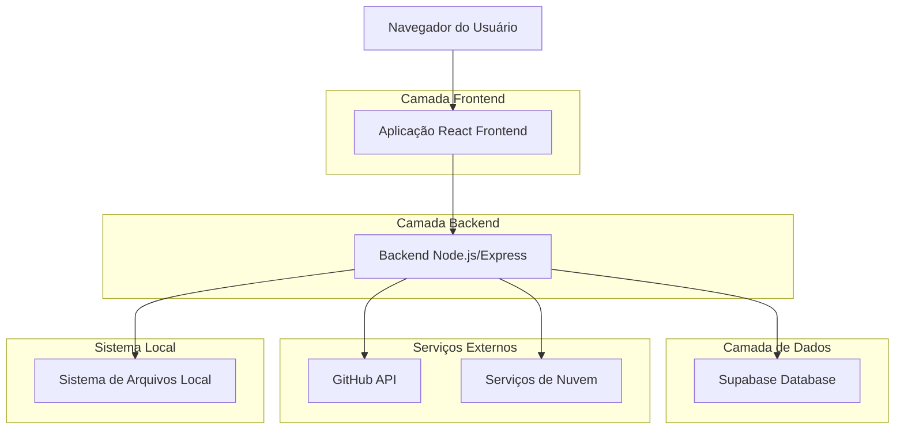
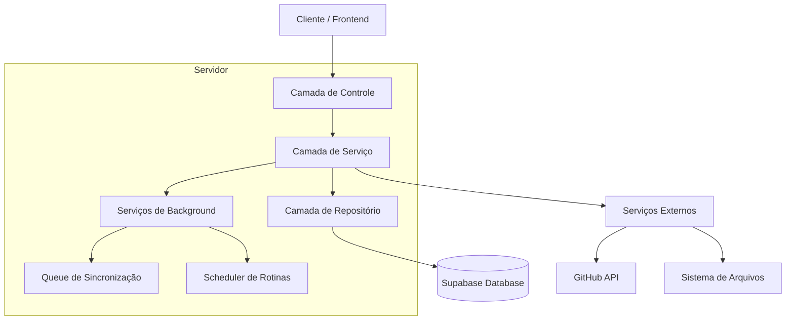
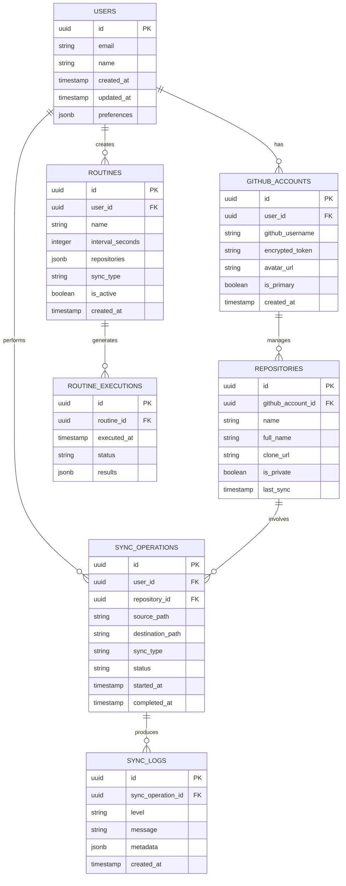

# Documento de Arquitetura Técnica: GitHub Sync Pro

## 1. Design da Arquitetura



## 2. Descrição das Tecnologias
- Frontend: React@18 + TypeScript + Tailwind CSS@3 + Vite
- Backend: Node.js@18 + Express@4 + TypeScript
- Database: Supabase (PostgreSQL)
- Autenticação: Supabase Auth + GitHub OAuth
- Deploy: Vercel (Frontend) + Railway (Backend)

## 3. Definições de Rotas
| Rota | Propósito |
|------|----------|
| / | Painel principal com todas as funcionalidades de sincronização |
| /profile | Página de configurações de perfil e gerenciamento de contas |
| /history | Histórico detalhado de sincronizações e logs |
| /auth/callback | Callback do GitHub OAuth para autenticação |

## 4. Definições de API

### 4.1 APIs Principais

**Autenticação GitHub**
```
POST /api/auth/github
```

Request:
| Nome do Parâmetro | Tipo | Obrigatório | Descrição |
|-------------------|------|-------------|----------|
| code | string | true | Código de autorização do GitHub OAuth |
| state | string | true | Estado de segurança para validação |

Response:
| Nome do Parâmetro | Tipo | Descrição |
|-------------------|------|----------|
| success | boolean | Status da autenticação |
| user | object | Dados do usuário GitHub |
| token | string | Token de acesso criptografado |

**Sincronização de Repositório**
```
POST /api/sync/repository
```

Request:
| Nome do Parâmetro | Tipo | Obrigatório | Descrição |
|-------------------|------|-------------|----------|
| source | string | true | URL ou caminho da origem |
| destination | string | true | URL ou caminho do destino |
| syncType | string | true | Tipo: 'push', 'pull', 'bidirectional' |
| createIfNotExists | boolean | false | Criar repositório se não existir |

Response:
| Nome do Parâmetro | Tipo | Descrição |
|-------------------|------|----------|
| success | boolean | Status da operação |
| syncId | string | ID único da sincronização |
| status | string | Status atual da operação |

**Configuração de Rotinas**
```
POST /api/routines/create
```

Request:
| Nome do Parâmetro | Tipo | Obrigatório | Descrição |
|-------------------|------|-------------|----------|
| name | string | true | Nome da rotina |
| interval | number | true | Intervalo em segundos |
| repositories | array | true | Lista de repositórios |
| syncType | string | true | Tipo de sincronização |

Response:
| Nome do Parâmetro | Tipo | Descrição |
|-------------------|------|----------|
| success | boolean | Status da criação |
| routineId | string | ID da rotina criada |

## 5. Diagrama da Arquitetura do Servidor



## 6. Modelo de Dados

### 6.1 Definição do Modelo de Dados



### 6.2 Linguagem de Definição de Dados

**Tabela de Usuários (users)**
```sql
-- criar tabela
CREATE TABLE users (
    id UUID PRIMARY KEY DEFAULT gen_random_uuid(),
    email VARCHAR(255) UNIQUE NOT NULL,
    name VARCHAR(100) NOT NULL,
    created_at TIMESTAMP WITH TIME ZONE DEFAULT NOW(),
    updated_at TIMESTAMP WITH TIME ZONE DEFAULT NOW(),
    preferences JSONB DEFAULT '{}'
);

-- criar índices
CREATE INDEX idx_users_email ON users(email);
CREATE INDEX idx_users_created_at ON users(created_at DESC);

-- permissões Supabase
GRANT SELECT ON users TO anon;
GRANT ALL PRIVILEGES ON users TO authenticated;
```

**Tabela de Contas GitHub (github_accounts)**
```sql
-- criar tabela
CREATE TABLE github_accounts (
    id UUID PRIMARY KEY DEFAULT gen_random_uuid(),
    user_id UUID REFERENCES users(id) ON DELETE CASCADE,
    github_username VARCHAR(100) NOT NULL,
    encrypted_token TEXT NOT NULL,
    avatar_url TEXT,
    is_primary BOOLEAN DEFAULT false,
    created_at TIMESTAMP WITH TIME ZONE DEFAULT NOW()
);

-- criar índices
CREATE INDEX idx_github_accounts_user_id ON github_accounts(user_id);
CREATE INDEX idx_github_accounts_username ON github_accounts(github_username);

-- permissões Supabase
GRANT SELECT ON github_accounts TO anon;
GRANT ALL PRIVILEGES ON github_accounts TO authenticated;
```

**Tabela de Repositórios (repositories)**
```sql
-- criar tabela
CREATE TABLE repositories (
    id UUID PRIMARY KEY DEFAULT gen_random_uuid(),
    github_account_id UUID REFERENCES github_accounts(id) ON DELETE CASCADE,
    name VARCHAR(255) NOT NULL,
    full_name VARCHAR(255) NOT NULL,
    clone_url TEXT NOT NULL,
    is_private BOOLEAN DEFAULT false,
    last_sync TIMESTAMP WITH TIME ZONE,
    created_at TIMESTAMP WITH TIME ZONE DEFAULT NOW()
);

-- criar índices
CREATE INDEX idx_repositories_account_id ON repositories(github_account_id);
CREATE INDEX idx_repositories_full_name ON repositories(full_name);
CREATE INDEX idx_repositories_last_sync ON repositories(last_sync DESC);

-- permissões Supabase
GRANT SELECT ON repositories TO anon;
GRANT ALL PRIVILEGES ON repositories TO authenticated;
```

**Tabela de Operações de Sincronização (sync_operations)**
```sql
-- criar tabela
CREATE TABLE sync_operations (
    id UUID PRIMARY KEY DEFAULT gen_random_uuid(),
    user_id UUID REFERENCES users(id) ON DELETE CASCADE,
    repository_id UUID REFERENCES repositories(id) ON DELETE SET NULL,
    source_path TEXT NOT NULL,
    destination_path TEXT NOT NULL,
    sync_type VARCHAR(20) CHECK (sync_type IN ('push', 'pull', 'bidirectional')),
    status VARCHAR(20) DEFAULT 'pending' CHECK (status IN ('pending', 'running', 'completed', 'failed')),
    started_at TIMESTAMP WITH TIME ZONE DEFAULT NOW(),
    completed_at TIMESTAMP WITH TIME ZONE
);

-- criar índices
CREATE INDEX idx_sync_operations_user_id ON sync_operations(user_id);
CREATE INDEX idx_sync_operations_status ON sync_operations(status);
CREATE INDEX idx_sync_operations_started_at ON sync_operations(started_at DESC);

-- permissões Supabase
GRANT SELECT ON sync_operations TO anon;
GRANT ALL PRIVILEGES ON sync_operations TO authenticated;
```

**Tabela de Rotinas (routines)**
```sql
-- criar tabela
CREATE TABLE routines (
    id UUID PRIMARY KEY DEFAULT gen_random_uuid(),
    user_id UUID REFERENCES users(id) ON DELETE CASCADE,
    name VARCHAR(255) NOT NULL,
    interval_seconds INTEGER NOT NULL CHECK (interval_seconds > 0),
    repositories JSONB NOT NULL DEFAULT '[]',
    sync_type VARCHAR(20) CHECK (sync_type IN ('push', 'pull', 'bidirectional')),
    is_active BOOLEAN DEFAULT true,
    created_at TIMESTAMP WITH TIME ZONE DEFAULT NOW()
);

-- criar índices
CREATE INDEX idx_routines_user_id ON routines(user_id);
CREATE INDEX idx_routines_is_active ON routines(is_active);
CREATE INDEX idx_routines_interval ON routines(interval_seconds);

-- permissões Supabase
GRANT SELECT ON routines TO anon;
GRANT ALL PRIVILEGES ON routines TO authenticated;
```

**Dados iniciais**
```sql
-- inserir dados de exemplo
INSERT INTO users (email, name, preferences) VALUES 
('dev@example.com', 'Desenvolvedor Teste', '{"theme": "dark", "notifications": true}');
```